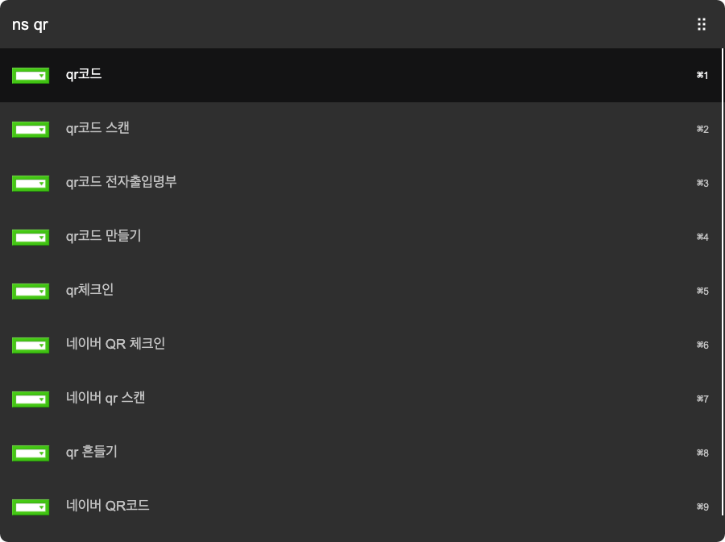

# arvis-simple-naver-search
[](http://badge.fury.io/js/arvis-simple-naver-search)
[](https://lbesson.mit-license.org/)
[](http://makeapullrequest.com)

Simple cross-platform Naver search workflow for Arvis



## Install

Install by npm

```
$ npm i -g arvis-simple-naver-search
```